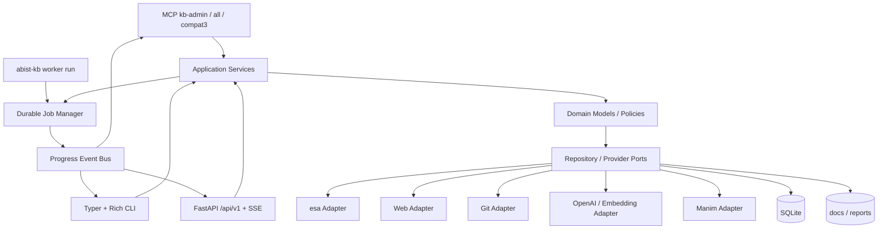

# ABIST Knowledge Base システム設計書

> 文書状態: MCP-only UI cutover 反映済み（Phase 3）  
> 作成日: 2026-08-03  
> 更新: 2026-08-05（Web／TUI／NiceGUI／Textual を一次UIから外し、MCP＋CLI＋REST を正とする）  
> 製品名: ABIST Knowledge Base  
> Gitリポジトリ名: `abist-knowledge-base`  
> 移行先: `C:\Temp\abist-knowledge-base`  
> Pythonパッケージ名: `abist-kb` / import `abist_kb`  
> CLIコマンド名: `abist-kb`  
> 移植元: `multi-source-knowledge-base`

## 1. 目的

現行のNode.js中心のナレッジベースを、実行コード・運用面・エージェント連携までPythonへ移植する。人間向けターミナル出力にはRichを使用し、エージェント／自動化向けの主操作面はMCPとする。

対象の操作面は次のとおりとする。

- **MCP（一次）**: 管理は `kb-admin`（または統合 `all`）。既存スキル向けに互換3サーバー `kb-download`／`kb-search`／`kb-visualize` を維持
- **CLI**: Typer + Rich（`abist-kb`）。長時間ジョブ実行は `abist-kb worker run`
- **REST API**: `abist-kb api serve` → FastAPI `/api/v1`（SSE・ヘルス含む）
- MCPサーバーのツール応答と運用ログ
- バッチ、同期、索引、埋め込み、検索、チャット、可視化の進捗・結果・エラー
- CI、ファイルリダイレクト、JSON出力などの非対話モード

> **歴史メモ（削除済み）:** 初版設計では NiceGUI Web／デスクトップと Textual TUI を人間向け一次UIとしていた。MCP-only UI cutover（Phase 2b）で `presentation/web`・`presentation/tui` および `ui web`／`ui tui` コマンドは削除済み。操作契約の正本は `design/ui-action-matrix.yaml`（面は `mcp`／`api`）。

既存のMarkdown、同期状態、バッチ設定、検索索引、埋め込み、可視化成果物は、検証可能なものを移行する。検索索引のように安全に再生成できるデータは、無理な直接変換より再構築を優先する。

## 2. 成功条件

- 現行のesa／Web／Git収集、差分同期、検索、チャット、可視化、監査、MCP機能をPython版で代替できる。
- 人間向けターミナル出力から素の`print()`を排除し、共通Presenter経由にする。
- TTYでは色、表、パネル、スピナー、進捗バー、Markdown、構文ハイライトを使用する。
- 非TTY、`NO_COLOR`、`TERM=dumb`、`--output json`ではANSI制御文字やアニメーションを出さない。
- MCP stdioの標準出力はJSON-RPC専用とし、ログやRich出力を混入させない。
- 現行データを変更せずに移行診断でき、実行前後の件数・ハッシュ・検索品質を比較できる。
- Windowsを第一対象とし、Linuxでも同一のテストを通す。

## 3. 移植範囲

### 3.1 機能

| 領域 | 移植する機能 |
|---|---|
| 収集 | esa記事、esaカテゴリ、Web再帰収集、Gitリポジトリ、手動Markdown |
| 同期 | ETag／更新日時／本文ハッシュ、dry-run、競合検知、欠落候補、強制更新、差分レポート |
| バッチ | esa／Web／Gitバッチの作成・編集・削除・実行、履歴、再実行、キャンセル |
| 索引 | Markdownチャンク、FTS5、実務／参照コーパス分離、差分索引、索引鮮度判定 |
| 埋め込み | ローカルmultilingual-e5-small、任意のOpenAI埋め込み、再開可能な差分生成 |
| 検索 | FTS5 + ベクトル検索 + RRF、フィルター、出典行、重複文書の正規パス |
| 文書 | 一覧、詳細、Markdown表示、front matter、履歴・同期状態、原文URL |
| チャット | ストリーミング回答、会話履歴、検索根拠、引用、モデル設定 |
| 品質管理 | 整合性検査、重複検出、矛盾候補、検索評価、知識昇格ドラフト |
| 可視化 | SceneSpec検証、出典ハッシュ検証、Manim PNG／MP4生成、成果物管理 |
| 連携 | MCP stdio、MCP Streamable HTTP、内部REST API（`/api/v1`） |
| 運用 | 設定、doctor、ログ、ジョブ履歴、バックアップ、移行、診断情報 |

`tools/pptx_to_md.py`などのOffice変換は現行Node本体ではなく周辺Pythonツールである。ただし「現在のシステム全体をPythonへ統一する」対象には含め、コア移植完了後に任意依存グループ`office`の補助コマンドとして移す。Office変換の未導入はコア機能の起動を妨げない。

### 3.2 非目標

- 旧Node Web UIのHTML/CSSを移植しない。人間向け画面ホスト（NiceGUI／Textual）も現行スコープ外とする。
- Node.jsランタイムを新システムの必須依存にしない。
- 移行時に現行`docs/`、`data/`、`reports/`を直接更新しない。
- 初版で複数サーバーによる分散ジョブ実行や大規模マルチテナントを実装しない。

## 4. 技術構成

| 用途 | 採用技術 | 方針 |
|---|---|---|
| Python | Python 3.12 | Manim・PyTorch・Windows互換性を優先 |
| パッケージ管理 | uv + `pyproject.toml` + `uv.lock` | ロックファイルをGit管理 |
| CLI | Typer + Rich | ヘルプ、入力検証、例外、結果をRich化 |
| MCP | MCP Python SDK | エージェント一次面。`kb-admin`／`all`＋互換3サーバー |
| API | FastAPI + uvicorn | `abist-kb api serve` → `/api/v1`、SSE、ヘルスチェック |
| モデル／設定 | Pydantic v2 + pydantic-settings | 面間で同じ入力・出力型を使用 |
| HTTP | httpx | esa、Web、OpenAIなどの非同期通信 |
| 永続化 | SQLite WAL + Python `sqlite3` | 同期状態、索引、ジョブ、会話を管理 |
| 全文検索 | SQLite FTS5 `unicode61`／`trigram` | 独立した2テーブルを構築し、実行時は設定された1方式を選択 |
| ベクトル | NumPy、正規化済みFloat32 BLOB | メモリキャッシュした行列との内積 |
| ローカル埋め込み | sentence-transformers | `intfloat/multilingual-e5-small` |
| AI | OpenAI Python SDKを既定アダプターとする | プロバイダー境界を設けて交換可能にする |
| 可視化 | Manim + ffmpeg | 既存SceneSpec 1.0との互換を維持 |
| テスト | pytest、pytest-asyncio、Hypothesis | 単体・契約・API／MCP契約までPythonに統一 |

Rich、Typer、MCP SDK、FastAPIなどの直接依存は、実装着手日にPyPIと公式リリースノートで安定版を再確認し、互換範囲を`pyproject.toml`、実際の版を`uv.lock`で固定する。正式名のうちパッケージ名・CLI名・環境変数接頭辞は`identity.py`へ隔離する。

FTS5は現行どおり`chunks_fts_unicode61`と`chunks_fts_trigram`を別々に構築する。本番検索は設定された1テーブル（既定`trigram`）を使い、その結果を2文字日本語向けLIKE補助検索とベクトル検索にRRFで統合する。2つのFTSランキング同士は互換移植段階では統合しない。`compare-tokenizers.js`相当の比較コマンドをPythonへ移植し、`eval/queries.jsonl`でRecall@5、MRR、nDCG@10、平均応答時間を再測定して既定値の変更可否を判断する。

## 5. アーキテクチャ



プレゼンテーション層からDBや外部APIを直接呼ばない。CLI、MCP、REST APIは同一のApplication Service（`ServiceContainer`）とPydantic DTOを利用し、処理結果とエラーコードを一致させる。操作キーと到達面の正本は`design/ui-action-matrix.yaml`。

### 5.1 パッケージ構成

```text
src/abist_kb/
  identity.py          # 表示名・パッケージ名・CLI名・環境変数接頭辞
  config.py            # 設定読込、パス、秘密情報参照
  domain/              # Document、Source、Batch、Job、SceneSpec、同期ポリシー
  application/         # ユースケースとDTO
  infrastructure/
    db/                # SQLiteスキーマ、リポジトリ、マイグレーション
    sources/           # esa、web、git、manual
    search/            # chunk、FTS5、embedding、RRF
    ai/                # chat／embedding provider
    visualization/     # Manim runner、artifact store
    jobs/              # WorkerSupervisor、leases、execution、events
    observability/     # logging、audit、metrics
  presentation/
    console/           # Rich theme、renderable、progress、error presenter
    cli/               # Typer commands（含 api serve / mcp serve / worker run）
    api/               # FastAPI routes／SSE（abist-kb api serve）
    mcp/               # MCP tools／resources（kb-admin / compat3 / all）
    common/            # ServiceContainer、actions（MCP/API共有）
  migration/           # 現行システム診断・移行・照合
tests/
design/
```

## 6. 共通UIデザイン

CLI（Rich）とAPI／MCPの状態ラベルで共通のセマンティックトークンを使う。色だけで状態を伝えず、必ずラベルまたは記号を併記する。

### 6.1 セマンティックトークン

| トークン | Rich | 記号 | 用途 |
|---|---|---|---|
| `primary` | `bold cyan` | `●` | 選択、主要操作 |
| `success` | `bold green` | `✓` | 完了、正常 |
| `warning` | `bold yellow` | `!` | 注意、競合、部分成功 |
| `danger` | `bold red` | `×` | 失敗、破壊的操作 |
| `info` | `blue` | `i` | 補足、進行中 |
| `muted` | `dim` | `-` | 補助情報、未実行 |
| `accent` | `magenta` | `◆` | AI、可視化、特別表示 |

> **歴史メモ:** 初版では Web hex（NiceGUI）と Textual 向けスタイル列も定義していた。コード上の`web_hex`フィールドはトークン定義の名残として残るが、画面ホストは存在しない。

Richは端末背景を尊重する。日本語と英数字の混在を前提に、罫線はRichの`safe_box`相当でフォールバック可能にする。絵文字は装飾としてのみ使い、絵文字なしでも意味が通る文言にする。

### 6.2 表示部品

- 一覧: Rich `Table`を使い、列順と状態ラベルを共通化する。
- 単一結果: タイトル付きPanel、要約、主要値、次の操作の順に表示する。
- 長時間処理: 全体・現在項目・完了数・失敗数・経過時間・残り時間を表示する。
- 不定長処理: Spinner + 現在の工程を表示し、完了時は静的な最終行へ置換する。
- 文書: Markdownとコードハイライトを使用し、出典パスと行番号を常時表示する。
- エラー: エラーコード、概要、原因、回復手順、`--debug`案内を同じ順序で表示する。
- 破壊的操作: 対象件数とパスを先に提示し、対話CLI／MCP／APIでは確認（`confirmed` 等）を必須とする。非対話CLIは`--yes`必須とする。

### 6.3 出力モード

CLI共通オプションは`--output auto|rich|plain|json`、`--color auto|always|never`、`--quiet`、`--verbose`、`--debug`とする。

- `auto`: TTYならRich、非TTYならplain。
- `rich`: Richを強制するが、`NO_COLOR`は尊重する。
- `plain`: ANSIとアニメーションなし。最終結果を安定した行形式で出す。
- `json`: stdoutへ単一JSONまたはJSON Linesのみ。進捗は抑止し、診断ログはstderrへ出す。
- MCP stdio: stdoutはプロトコル専用。Richを初期化せず、ログはstderrまたはファイルへ出す。

## 7. 各操作面の情報設計

### 7.1 REST API（`abist-kb api serve`）

FastAPIで`/api/v1`を提供する。起動は`abist-kb api serve`（uvicorn）。NiceGUI等の画面ホストへの組み込みは行わない。

操作領域（マトリクスの screen に対応）:

1. ダッシュボード相当: 文書数、同期状態、索引鮮度、直近ジョブ、警告（参照）。
2. ソース／バッチ: esa・Web・GitソースとバッチのCRUD、接続テスト、実行。
3. ジョブ: 進捗（SSE）、キャンセル、再実行、結果。
4. 文書: コーパス／状態／ソースの絞り込み、メタデータ更新、削除。
5. 検索: ハイブリッド検索。
6. チャット: 会話開始、質問、履歴。
7. 可視化: SceneSpec検証、レンダリング投入、依存診断。
8. 品質: 整合性、重複、矛盾候補、メタデータ補完（dry-run）。
9. 設定／診断: パス、モデル、接続、ffmpeg・Manim・FTS5診断。

既定は`127.0.0.1`へバインドする。`0.0.0.0`へ公開する場合はアクセストークンまたはリバースプロキシ認証を必須とする。ジョブ進捗SSEはDBのジョブ履歴をポーリングして配信する（別プロセスの`worker run`が書いたイベントも届く）。

業務操作は`presentation/api/facade.py`経由でApplication Serviceを呼び、操作キーは`design/ui-action-matrix.yaml`と一致させる。

### 7.2 MCP（一次のエージェント操作面）

**推奨接続:**

| 用途 | サーバーキー | 起動 |
|---|---|---|
| エージェント（推奨） | **`all`** | `abist-kb mcp serve all`（検索 + 管理 + jobs） |
| 管理のみ | `kb-admin` | `search_kb` なし。KB 回答は `chat_ask` 経由 |
| 既存スキル互換 | `kb-download`／`kb-search`／`kb-visualize` | `abist-kb mcp serve <name>` |
| REST | — | `abist-kb api serve` |
| 長時間ジョブ | — | `abist-kb worker run` |

内部実装は1つのPythonモジュールへ統合するが、外部には現行と同じ3サーバーを互換エントリポイントとして提供する。`kb-admin`は管理操作（旧Web／TUI相当）をApplication Service直呼びで公開する。統合サーバー`all`は互換3＋管理を同一プロセスで公開する追加機能であり、既存3サーバーのスキーマを置き換えない。

#### 7.2.1 互換性の定義

互換性は次の3層すべてを対象とする。

1. ツール名: 下表の既存15ツールを同名で公開する。
2. 入出力: 入力フィールド、必須／任意、既定値、同期完了までの待機、成功・失敗JSON、`isError`、タイムアウトを維持する。
3. サーバー構成: `.mcp.json`の`kb-download`、`kb-search`、`kb-visualize`という3キーと、各サーバーのツール所属を維持する。

| 互換サーバー | 既存のまま提供するツール |
|---|---|
| `kb-download` | `list_batches`、`run_batch`、`add_web_batch`、`download_esa_post`、`download_esa_category`、`download_esa_search`、`download_web`、`download_git` |
| `kb-search` | `search_kb`、`get_document`、`get_chunk`、`index_status` |
| `kb-visualize` | `list_scene_kinds`、`check_visualize_deps`、`render_scene` |

Python移植前に現行3サーバーへ固定リクエストfixtureを送って応答を保存し、Python版へ同じfixtureを送る契約テストを作る。比較対象はJSONテキスト内のキー、型、必須性、エラーコード、0件時の意味、パス表記とし、時刻、処理時間、一時パスだけを正規化する。

#### 7.2.2 同期ツールと新規ジョブ型ツール

既存の`run_batch`、`download_*`、`render_scene`は、内部でジョブレコードを作成しても呼び出し元にはジョブIDだけを返さない。処理完了まで待機し、現行と同じ結果JSONを返す。`run_batch`最長60分、Web最長30分、Git最長15分、esa最長10分、render最長10分という既存契約も維持する。

非同期実行は別名の新規ツールとしてのみ追加する。

- バッチ／取得: `start_run_batch`、`start_download_esa_post`、`start_download_esa_category`、`start_download_esa_search`、`start_download_web`、`start_download_git`
- 可視化: `start_render_scene`
- ジョブ操作: `job_status`、`cancel_job`
- 新規参照: `get_batch`、`list_corpora`、`system_status`

`start_*`は`{ok:true, job_id, state:"queued"}`を返す。新規ツールは統合サーバー`all`および対応する互換サーバーに追加できるが、既存ツールのスキーマや応答へフィールドを追加しない。MCP stdioではstdoutをJSON-RPC専用とし、Richを初期化せず、ログはstderrへ送る。

#### 7.2.3 クライアント移行

第1段階は`.mcp.json`の3キーを変えず、実行コマンドだけNode.jsからPythonの各互換エントリポイントへ差し替える。`searching-kb`、`downloading-kb-docs`、`visualizing-kb`の既存手順は変更しない。

エージェント新規接続は**`all`**を推奨する（検索と管理を同一エージェントで使うため）。管理操作だけなら`kb-admin`でもよいが、`search_kb`は含まれない。互換3キーの削除は別リリースの破壊的変更とし、移行ガイド、設定差分、ロールバック手順を提示する。それまでは3サーバー構成を正式サポートする。

### 7.3 CLI

コマンド体系:

```text
abist-kb source list|add|edit|remove|test
abist-kb batch list|show|add|edit|remove|run
abist-kb sync source|batch|all
abist-kb index build|embed|status
abist-kb search <query>
abist-kb document show <path>
abist-kb chat
abist-kb visualize kinds|check|render
abist-kb audit integrity|duplicates|contradictions|search-quality
abist-kb curate promote
abist-kb jobs list|show|cancel|retry
abist-kb worker run
abist-kb api serve
abist-kb mcp serve kb-download|kb-search|kb-visualize|kb-admin|all [--transport stdio|http]
abist-kb migrate inspect|plan|run|verify
abist-kb config show|path|validate
abist-kb doctor
```

> **歴史メモ:** 初版の`<cli> ui web|desktop|tui`は削除済み。画面ホストは提供しない。

## 8. アプリケーション境界

主要サービスは次のインターフェースに分離する。

| サービス | 主な操作 |
|---|---|
| `SourceService` | source CRUD、接続確認、一覧取得 |
| `SyncService` | plan、execute、conflict resolution、verify |
| `BatchService` | batch CRUD、run |
| `DocumentService` | list、get、metadata update、safe delete |
| `IndexService` | build、embed、status、staleness check |
| `SearchService` | lexical、semantic、hybrid、citation resolve |
| `ChatService` | conversation、stream answer、citation validation |
| `VisualizationService` | validate spec、verify sources、render、list artifacts |
| `AuditService` | integrity、duplicates、contradictions、evaluation |
| `JobService` | submit、progress、cancel、retry、history |
| `MigrationService` | inspect、plan、copy/import、verify、rollback |

例外は`AppError(code, message, hint, details, retryable)`へ正規化する。外部API例外やSQLite例外を呼び出し面へ直接露出しない。`--debug`時だけRich Tracebackをstderrへ表示し、通常時はエラーコードと回復手順を表示する。

終了コードは`0`成功、`1`処理失敗、`2`入力不正、`3`設定不備、`4`外部サービス失敗、`5`競合／部分成功、`130`利用者キャンセルとする。

## 9. データ設計

### 9.1 ファイル

- `docs/`: Markdown正本。UTF-8、パスはdocs相対のPOSIX形式で管理する。
- `reports/`: 同期、監査、評価、可視化成果物。
- `data/app.sqlite`: ソース、バッチ、同期状態、ジョブ、会話、監査。
- `data/work-index.sqlite`: 実務コーパスのFTS5・チャンク・埋め込み。
- `data/reference-index.sqlite`: 参照コーパスのFTS5・チャンク・埋め込み。
- `data/cache/`: Gitミラー、HTTPキャッシュ、モデルキャッシュ参照情報。
- `config/settings.toml`: 秘密でない設定。
- `.env`: 秘密情報。移行時に値を自動コピーしない。

### 9.2 主要テーブル

- `sources`: ID、型、表示名、接続設定JSON、出力先、enabled、作成・更新日時。
- `batches`／`batch_items`: バッチ定義、順序、ソース参照、個別オプション。
- `documents`: 現行`sync-state.sqlite.documents`の全列を保持し、UUIDとsource_idを追加。
- `jobs`／`job_events`: 状態、進捗、結果、エラー、キャンセル要求、再試行元。
- `worker_leases`: ワーカーリーダーの所有者ID、heartbeat、lease期限。
- `resource_leases`: `docs-write`、`corpus-write:<corpus>`、`render`の排他所有者と期限。
- `conversations`／`messages`／`citations`: チャットと根拠。
- `visualizations`: SceneSpec、状態、成果物manifest、出典検証結果。
- `audit_runs`／`audit_findings`: 監査履歴と指摘。
- 索引DBの`documents`、`chunks`、`embeddings`、`meta`、FTS5テーブルは現行互換列を維持する。

SQLiteはWALを使い、`PRAGMA foreign_keys=ON`、`busy_timeout=5000`を設定する。スキーマ変更は連番マイグレーションで行い、`schema_migrations`へ適用履歴を記録する。

## 10. ジョブと進捗

同期、バッチ、索引、埋め込み、監査、可視化はすべて永続ジョブとして扱う。ジョブ状態は`queued`、`running`、`succeeded`、`partial`、`failed`、`cancelled`、`interrupted`とする。

### 10.1 ワーカーの起動主体

長時間ジョブのキュー消費は`abist-kb worker run`が起動する`WorkerSupervisor`が担う。SQLiteの`worker_leases`でリーダー取得を試みる。所有者はプロセスUUID、heartbeatは5秒間隔、lease期限は15秒とし、同時にキューからジョブを取得できるのはリーダー1プロセスだけとする。リーダー停止後はlease期限切れを待って別プロセスが引き継ぐ。

MCPや`api serve`はApplication Serviceとジョブ投入・照会を提供するが、埋め込みワーカーとしては起動しない。常駐ワーカーが必要なヘッドレス環境では`abist-kb worker run`を明示起動する。複数の`worker run`を同時起動しても1プロセスだけがキューを消費する。

> **歴史メモ:** 初版では Web／デスクトップ／TUI／MCP の各長時間エントリが起動時に`WorkerSupervisor`を開始する想定だった。MCP-only cutover後は`worker run`が正の起動主体。

一回実行CLIは既定で処理をそのプロセス内で同期実行し、完了までRich進捗を表示する。`--detach`指定時だけキューへ投入して終了するが、有効なworker heartbeatが無ければ`WORKER_UNAVAILABLE`で失敗し、実行されないジョブを放置しない。

### 10.2 同期互換実行と排他

既存MCPの同期ツールは呼び出しプロセス内でジョブを実行して完了を待つ。キューワーカーを必須にせず、既存の応答時間・結果形状を維持する。インライン処理も`resource_leases`を取得するため、他プロセスのキュージョブと競合しない。

- `docs-write`: バッチ、esa、Web、Git同期を全プロセス横断で直列化する。
- `corpus-write:<corpus>`: 同一コーパスの索引更新と埋め込み更新が同じleaseを取得し、相互排他で実行する。
- `render`: Manimレンダリングを全プロセス横断で1件に制限する。

既存ツールが実行中に同種ツールを呼ばれた場合のbusy／`CONCURRENT_RENDER`などのエラー意味は維持する。lease取得とジョブclaimは`BEGIN IMMEDIATE`トランザクションで行い、プロセス内`asyncio.Lock`だけに依存しない。

### 10.3 実行と復旧

I/O処理はAnyIOのタスクグループ、CPU負荷の高い埋め込みとManimは子プロセスで実行する。アプリ異常終了時、heartbeatとresource leaseが期限切れになった`running`ジョブは次回リーダーが`interrupted`へ変更し、安全に再試行できるジョブだけを利用者確認後に再投入する。

`ProgressEvent`は`job_id`、`phase`、`current`、`total`、`message`、`percent`、`item`、`timestamp`を持つ。APIはSSE、CLIはインプロセス購読、MCPは`job_status`で同じイベントを参照する。

## 11. 既存データ移行

### 11.1 原則

- 移行元は常に読み取り専用で開く。
- 移行先は空の一時ディレクトリへ作成し、検証成功後に正式データディレクトリへ切り替える。
- 各工程で件数、SHA-256、欠落、変換警告を`migration-manifest.json`へ記録する。
- 失敗時は移行先を破棄でき、移行元には変更が残らない。

### 11.2 移行区分

| データ | 方針 | 判定 |
|---|---|---|
| `docs/` Markdown | バイト保持コピー。パス、文字コード、front matterを検証 | 原則移行 |
| `docs/knowledge/` | 同上。実務／参照コーパス分類も維持 | 原則移行 |
| `data/sync-state.sqlite` | Python `sqlite3`で読取り、新`documents`へ列単位import | 移行 |
| `batch-config.js` | `export const batchConfigs =`部分を安全に抽出し、JSON5として解析。JavaScriptは実行しない | 移行 |
| `reports/visualizations/` | manifestと成果物ハッシュを検証してコピー | 移行 |
| 同期／監査レポート | 過去成果物としてコピーし、新DBには参照だけ登録 | 任意移行 |
| `data/git-cache/` | リモートURLとHEADを検証できたものだけコピー | 任意移行 |
| `.env` | キー名だけ診断し、値は利用者が新規設定 | 自動移行しない |
| `kb-index.sqlite`／`reference-index.sqlite` | 検索正確性を優先してMarkdownから再構築 | 原則再生成 |
| 埋め込みBLOB | 下記互換ゲートを通過した場合だけ再利用 | 条件付き移行 |

現行索引はSQLite FTS5、チャンク、正規化済みFloat32リトルエンディアンBLOBであり、Pythonから読み取れる。ただしチャンク規則やモデル実装が変わると検索結果がずれるため、索引そのものは再構築する。

`batch-config.js`の自動解析は、現行`batch-config-store.js`の`formatConfig`が生成する、オブジェクトリテラル・配列・文字列・数値・真偽値だけの固定形式を前提とする。構文外の手書きJavaScript、式、関数、テンプレート文字列を検出した場合は`UNSUPPORTED_BATCH_CONFIG`として停止し、推測変換やJavaScript実行はしない。利用者が修正したJSON5または移行用JSONを指定して再実行できるようにする。

埋め込み再利用の前に、現行JavaScriptとPythonでfront matter除外、改行正規化、チャンク境界、見出し連結、文字数切詰め、e5の`query:`／`passage:`接頭辞、UTF-8 SHA-256がビット一致するfixtureテストを通す。`content_hash`と`input_hash`が同じ入力から完全一致しない実装では、埋め込み再利用判定へ進まない。

埋め込み再利用は、現行チャンクの`content_hash`、`input_hash`、次元、モデル、チャンクID対応が一致するものに限定する。`Xenova/multilingual-e5-small`と`intfloat/multilingual-e5-small`の互換性は100件の層化サンプルで再計算し、同一入力のコサイン類似度が全件0.999以上、かつ既存評価クエリのRecall@5低下が0.01以内の場合だけ合格とする。不合格なら全件をPythonで再生成する。

### 11.3 移行コマンド

```text
abist-kb migrate inspect --from <old-root>
abist-kb migrate plan --from <old-root> --to <new-data-root>
abist-kb migrate run --plan <plan.json>
abist-kb migrate verify --manifest <migration-manifest.json>
```

本移行の既定値は`--from C:\Temp\multi-source-knowledge-base`、`--to C:\Temp\abist-knowledge-base`とする。いずれも設定またはCLI引数で明示的に上書きできるようにし、移行元と移行先が同一または親子関係にある場合は安全のため拒否する。

`inspect`は変更せず移行候補、容量、件数、スキーマ版、文字化け疑い、壊れたfront matterを報告する。`plan`はコピー／変換／再生成／除外をファイル単位で確定する。`run`は再開可能にし、完了済みハッシュが一致する工程をスキップする。

### 11.4 検証条件

- Markdownファイル数、相対パス集合、本文SHA-256が一致する。
- 同期状態の各source／sync_status別件数が一致する。
- バッチ名、型、対象、出力先、深さ、遅延、ブランチが一致する。
- 可視化成果物のmanifestと出力ファイルSHA-256が一致する。
- 新索引の対象文書集合が移行済み同期状態と一致する。
- 現行評価クエリでRecall@5、MRR、出典行一致率を比較し、Recall@5低下0.01以内、出典行一致率95%以上を満たす。

## 12. セキュリティと安全性

- APIキー、esaトークン、Git資格情報をDB、ログ、移行manifestへ書かない。
- ログ出力前に`*_TOKEN`、`*_KEY`、Authorization、Cookie、URL資格情報をマスクする。
- 出力パスは解決後に`docs/`または`reports/`配下であることを確認し、`..`、絶対パス、Windows予約名を拒否する。
- Web収集は同一ホストを既定とし、最大深さ、最大ページ数、サイズ、タイムアウトを必須上限にする。
- Gitは任意フックを実行せず、取得内容をデータとして扱う。
- Markdown内HTMLをAPI等で返す場合はサニタイズする。
- 文書削除、バッチ削除、強制同期は監査イベントへ記録する。

## 13. テスト設計

### 13.1 単体・契約テスト

- front matter、CRLF/LF混在、日本語パス、Windows予約名、パストラバーサル。
- 同期判定のcreate／update／unchanged／conflict／local_modified／missing。
- チャンク境界、行番号、content hash、canonical path。
- FTS5、ベクトル、RRF、フィルター、index stale。
- `unicode61`／`trigram`の2テーブル構築、実行時トークナイザ選択、短語LIKE補助、比較指標。
- SceneSpec 1.0、予約kind、出典hash、出力パス制限。
- 各Application ServiceをCLI、MCP、APIから呼んだ際のDTO／エラーコード一致。
- 現行15 MCPツールについて、名前・入力スキーマ・同期応答・エラー・所属サーバーを固定fixtureで比較する。
- `design/ui-action-matrix.yaml`の操作がMCP／APIから到達できること（`tests/mcp/test_matrix_actions_contract.py`）。
- `--output json`とMCP stdoutにANSIやログが混ざらないこと。
- 複数ワーカーを同時起動してもworkerリーダーが1つで、resource leaseにより書込み処理が重複しないこと。

### 13.2 操作面テスト

- Rich Consoleを固定幅・`color_system=None`でcaptureし、表・エラー・plain出力をスナップショット比較する。
- FastAPI／MCPの契約テストで主要操作フロー、破壊的操作の確認、エラーコードを検証する。
- MCP／API／CLIで同じジョブが同じ状態・件数・エラーを返すことを契約テストする。

> **歴史メモ:** 初版の Textual Pilot／NiceGUI fixture／Playwright画面E2Eは、画面ホスト削除に伴い対象外。

### 13.3 移行・E2E

- 現行スキーマの縮小fixtureから全移行を実行し、再実行しても重複しないこと。
- 実データではread-only診断を先に実行し、容量と所要時間を記録する。
- esaモック、ローカルHTTPサイト、一時Gitリポジトリで差分同期を検証する。
- 実Manim／ffmpegテストは明示フラグ時だけ実行する。
- Windows PowerShellとLinuxで`uv sync --locked`、pytest、CLI smoke、MCP Inspectorを実行する。
- `doctor`でSQLite実行版が3.34.0以上、FTS5有効、`trigram`テーブル作成・MATCH可能であることを実測する。利用不可なら起動時に黙って縮退せず、`FTS5_TRIGRAM_UNAVAILABLE`と再構築手順を表示する。

## 14. 移植手順

1. 新リポジトリ、`pyproject.toml`、共通設定、Richテーマ、エラー型、SQLiteマイグレーション基盤を作る。
2. front matter、同期状態、改行・ハッシュ・チャンク・e5入力、検索、出典検証を現行テストfixtureごと移植し、JavaScript版とのビット一致を確認する。
3. esa／Web／Git収集とバッチ、永続ジョブ、Rich CLIを実装する。
4. FTS5の2テーブル構築、トークナイザ比較、埋め込み、ハイブリッド検索、3つの互換MCPサーバーと任意の統合サーバーを実装する。
5. FastAPI `/api/v1`、`kb-admin`、操作マトリクス契約を同じApplication Service上へ実装する（画面ホストは実装しない）。
6. チャット、監査、可視化、知識昇格を移植する。
7. 移行ツールをread-only診断、dry-run、本移行、検証の順に実装する。
8. 並行稼働で検索品質と同期結果を比較し、受入条件を満たしてからPython版を正本に切り替える。
9. 旧システムは読み取り専用で1リリース保持し、復旧不要を確認後に廃止する。

## 15. 受入条件

- 現行の主要コマンドとMCPツールに対応するPython版操作が存在する。
- 既存15 MCPツールの名前・入出力・同期動作と`kb-download`／`kb-search`／`kb-visualize`の所属が契約テストで一致する。
- エージェント一次面は`kb-admin`（または`all`）、RESTは`abist-kb api serve`、長時間ジョブは`abist-kb worker run`で到達できる。
- `design/ui-action-matrix.yaml`の操作がMCP／APIから到達でき、破壊的操作は確認必須である。
- CLIのセマンティックトークンと状態ラベルが共通である。
- 30秒を超える処理に進捗、キャンセル、履歴、再試行がある。
- 非TTY、plain、JSON、MCPの各出力契約テストが通る。
- 現行データ移行のmanifestに未説明の欠落がない。
- 検索品質、出典行、同期判定、SceneSpec互換の回帰基準を満たす。
- Windowsで日本語パス・日本語端末表示・UTF-8ファイルが文字化けしない。
- Windowsと対応Linux環境でSQLite 3.34.0以上、FTS5、`unicode61`、`trigram`が`doctor`と受入テストに合格する。
- 秘密情報がログ、DB、移行成果物、テストスナップショットに含まれない。

## 16. 識別子

製品名は`ABIST Knowledge Base`、リポジトリ名は`abist-knowledge-base`、移行先は`C:\Temp\abist-knowledge-base`で確定する。

- Python配布パッケージ名／import名: `abist-kb`／`abist_kb`
- CLI実行ファイル名: `abist-kb`
- 環境変数の共通接頭辞: `identity.py`に隔離（実装時の値に従う）

## 17. 参照資料

- 移植方針の起点: [Pythonの標準出力をもっと美しく。Richで作るモダンなCLIツール入門](https://qiita.com/nozomi2025/items/313779e2d3feadfefa7e)
- [Rich Console API](https://rich.readthedocs.io/en/stable/console.html)
- [Rich Progress](https://rich.readthedocs.io/en/latest/progress.html)
- [Typer公式ドキュメント](https://typer.tiangolo.com/)
- [FastAPI](https://fastapi.tiangolo.com/)
- [MCP Python SDK](https://github.com/modelcontextprotocol/python-sdk)
- [MCP Python SDK PyPI](https://pypi.org/project/mcp/)
- [uv: Locking and syncing](https://docs.astral.sh/uv/concepts/projects/sync/)
- [intfloat/multilingual-e5-small](https://huggingface.co/intfloat/multilingual-e5-small)
- 操作マトリクス正本: [`design/ui-action-matrix.yaml`](ui-action-matrix.yaml)
- MCP cutover 記録: [`design/plans/M9-mcp-cutover.md`](plans/M9-mcp-cutover.md)
